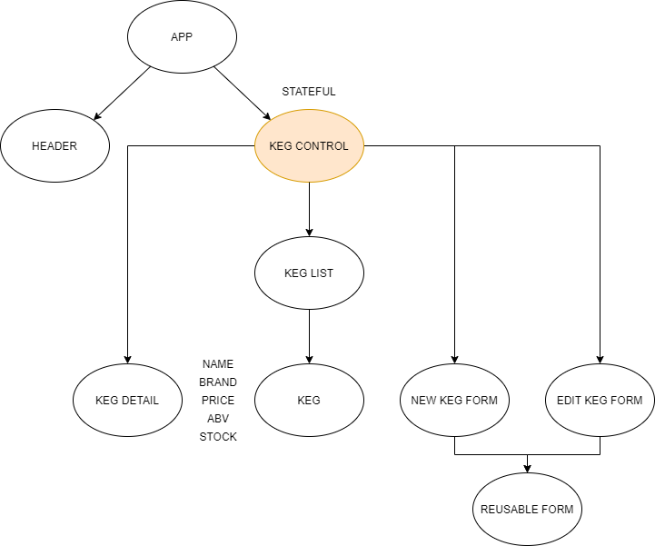

## Ricc's Rickety TapRoom - React WebPage 

### _Full CRUD webpage for mainting a keg list at at TapRoom, vs: 02/12/2021_

### _Created by: Eric Stratton_

## Description

Create new kegs with name, brand, and price as properties, update existing keg details, click on keg in list to view its details, remove keg from list when necessary. 

## Setup/Instillation

### Requirements:

- Internet browser
- Code editor if you wish to view/edit the code (recommended)
- Node.js
- React

### Node:

- Node is a requirement for running this applcation, if you need to install it visit <https://nodejs.org/en/download/> and download the applicable version for your system

### Download: 

- Download this repository by clicking the green 'Code' icon and selecting download zip
- Use your favorite zip.file opener to extract files to your local device
- Follow instructions below begging with line instructing to run command `$ cd tap-room`

### Terminal:

- Open command terminal on local device
- Navigate to desktop in terminal using `$ cd desktop`
- Copy repository link by clicking on green 'Code' icon and clicking the clipboard to the right of the url
- Use command `$ git clone https://github.com/EricStratton/tap-room`
- From desktop, run command `$ cd tap-room` to navigate to the installed directory
- Once in root directory of project run command `$cd tap-room` to enter the project directory
- Run command `$ code .` to open directory in default code editor
- While inside `tap-room` in your terminal run `$ npm install` to download necessary Node packages for application functionality
- Run command `$ npm run build` to ensure that project succesfully builds on your device
- Run command `$ npm run start` to open webpage in defualt browse with an `3000` local server 

### Component Diagram:

## Known Bugs

There are no known bugs at this time.

## Support & Contact Details

Do not hesitate to contact me at:

<strattonericj@gmail.com>

## Technologies

- _Visual Studio Code_
- _HTML5_
- _CSS_
- _JavaScript_
- _Node.js_
- _React_
- _Git_
- _GitHub_

## Licensing

Copyright (c) 2020 **_Eric Stratton_**

This software is licensed under the MIT license
